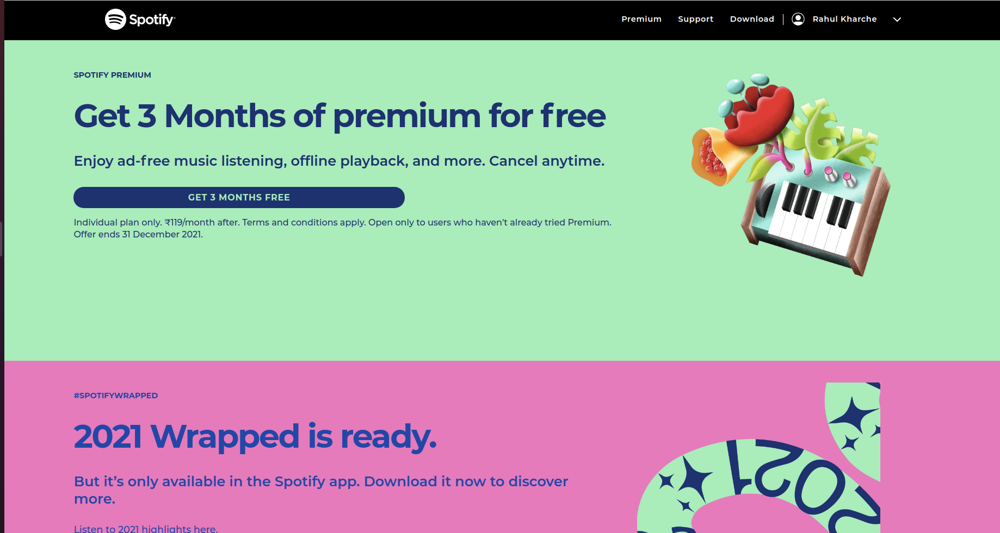
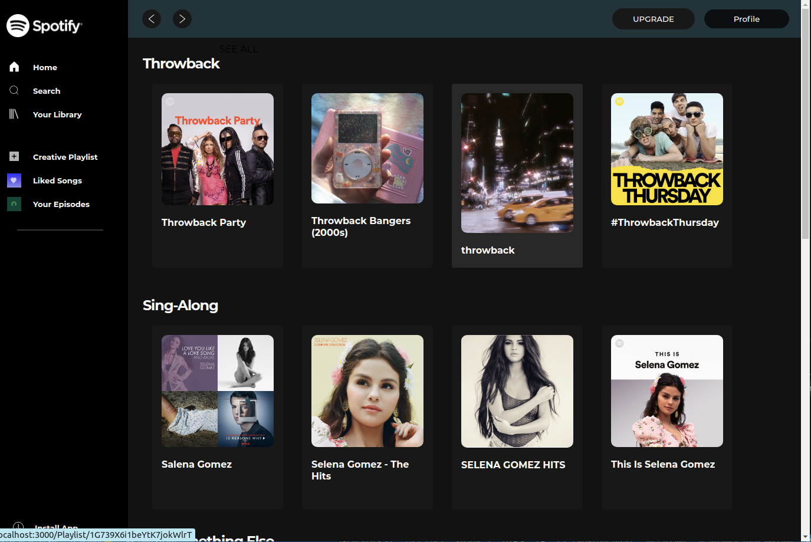
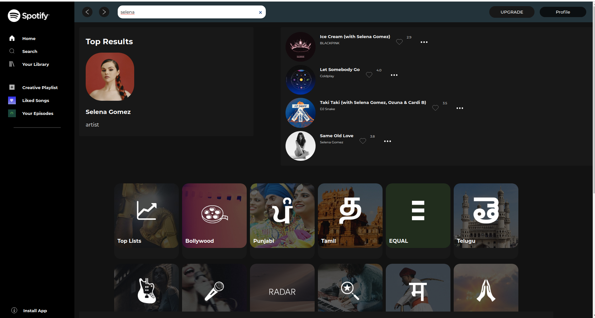
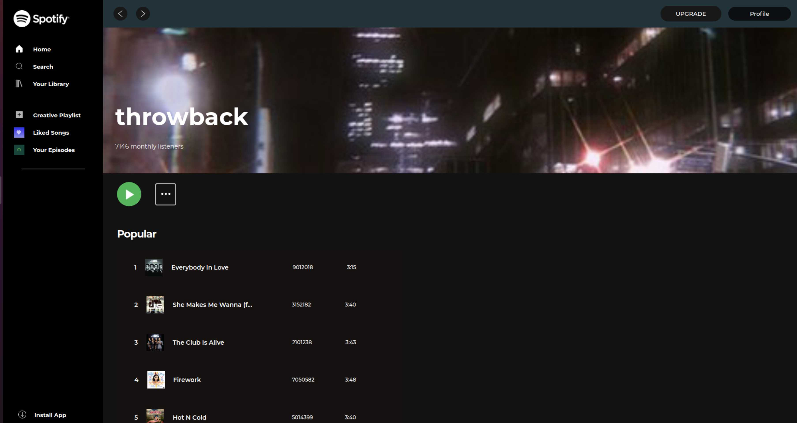

# Spotify Clone

## Description:

This project is a clone of spotify website.In Spotify's apps, music can be browsed or searched for via various parameters, such as artist, album, genre, playlist. Users can create, edit and share playlists, and make playlists with other users.
## Technologies Used:

- HTML
- CSS
- ReactJS
- SpotifyAPI
- Javascript
- Material UI

## Packages Used:

- React Router

## How to Use:

- Clone the app
- Do `npm i` to install the necessary packages
- Do `npm start` the app will run on port 3000

## Authors Information:

- Rahul Kharche https://github.com/RahulK2699
- Ramendra Vikram Singh Parihar https://github.com/rv-vikram
- Anup Kumar Pandey https://github.com/Anuppandey009
- Shikha Tiwari https://github.com/shikha-max

## App Images

## Login Page

  

## HomePage

## Search Page

## Album Page

